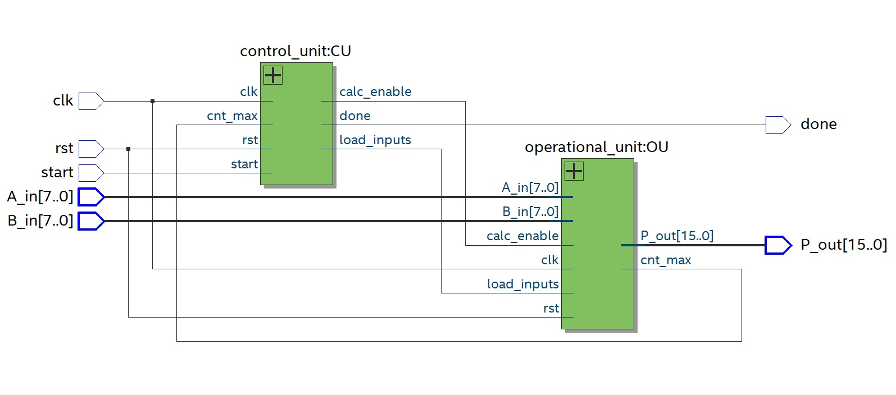
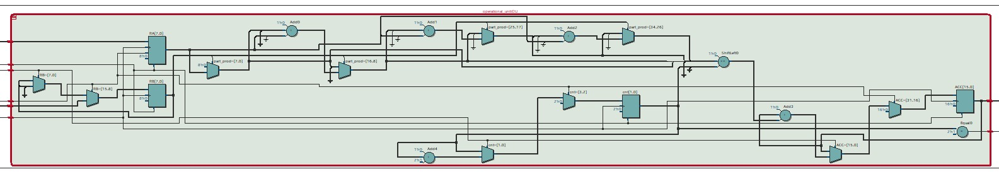
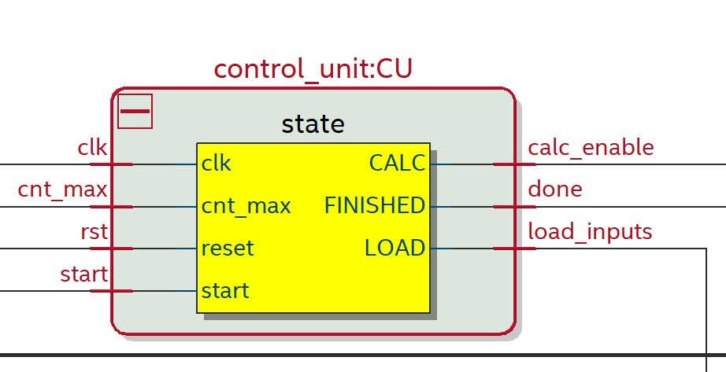

# ⚙️ Radix‑16 Serial Multiplier (VHDL) — CU/OU Architecture

> **Course:** Digital Systems / VHDL Final Project  

> **Author:** Yariv Shossberger  

> **Variant:** **Radix‑16** (nibble‑wise) synchronous serial multiplier

---

## 📌 Overview
This repository implements a **synchronous Radix‑16 multiplier** that multiplies two unsigned operands using a **control unit (CU)** and an **operational/datapath unit (OU)**.  

The CU is a finite‑state machine that sequences the calculation; the OU generates nibble‑wise partial products and accumulates them into the final result.

* Default interface: `A_in(7 downto 0)`, `B_in(7 downto 0)`, `P_out(15 downto 0)`  * Handshake: `start` input, `done` output  * Synchronous reset `rst`, clock `clk`

> The Radix‑16 approach processes **4 multiplier bits per iteration**, reducing the number of cycles compared to bit‑serial designs. For an N‑bit operand, the number of iterations is **ceil(N/4)** (e.g., N=8 → 2 iterations).

---

## 🧩 Top‑Level Ports
| Signal | Dir | Width | Description |
|-------|-----|-------|-------------|
| `clk`   | in  | 1  | System clock |
| `rst`   | in  | 1  | Synchronous reset |
| `start` | in  | 1  | Pulse to begin a multiplication |
| `A_in`  | in  | 8  | Multiplicand |
| `B_in`  | in  | 8  | Multiplier |
| `P_out` | out | 16 | Product |
| `done`  | out | 1  | Asserted for one cycle when product is ready |

*(Widths may be generalized in code; defaults above match the provided RTL and testbench.)*

---

## 🏗️ Architecture
The design is split into two entities to keep control separate from datapath:

1. **Control Unit (CU)** — FSM with states **LOAD → CALC → FINISHED** (IDLE/WAIT implicit).  

   Drives `load_inputs`, `calc_enable`, counts iterations using `cnt_max`, and raises `done` at completion.

2. **Operational Unit (OU)** — registers and arithmetic: multiplicand/multiplier registers, accumulator (**ACC**), shifters, and adders.  

   On each enabled cycle it forms the **partial product of A_in × nibble(B)** and accumulates it with appropriate shifts.

### Block‑level RTL (from synthesis)
- **Top‑level (CU ↔ OU interconnect):**  

  
- **Operational Unit (datapath):**  

  
- **Control Unit (FSM):**  

  

---

## 🧪 Testbench
File: **`tb_radix16_mult_cu_ou.vhd`**

What it does:
- Generates clock & reset, applies multiple `(A,B)` vectors
- Pulses `start`, waits for `done`
- Checks `P_out` vs. reference (behavioral multiply) and prints results
- Stops on mismatch or when all tests pass

> Simulation results (sample run) and a short design note are included in the `docs/` folder.

---

## ▶️ How to Simulate

### Option A — ModelSim / Questa
```tcl
# In ModelSim/Questa console
vlib work
vcom radix16_mult_cu_ou.vhd
vcom tb_radix16_mult_cu_ou.vhd

vsim work.tb_radix16_mult_cu_ou
add wave -r /*
run -all
```
If you use VHDL‑2008 features, pass `-2008` to `vcom`.

### Option B — GHDL + GTKWave
```bash
ghdl -a --std=08 radix16_mult_cu_ou.vhd
ghdl -a --std=08 tb_radix16_mult_cu_ou.vhd
ghdl -e --std=08 tb_radix16_mult_cu_ou
ghdl -r --std=08 tb_radix16_mult_cu_ou --vcd=wave.vcd
gtkwave wave.vcd
```

---

## 📂 Repository Layout
```
vhdl-radix16-mult/
├── src/
│   ├─ radix16_mult_cu_ou.vhd      # Top-level + CU/OU entities/arch
│   └─ tb_radix16_mult_cu_ou.vhd   # Testbench
├── docs/
│   ├─ proj_overview.mp4            # Summary recording (Hebrew)
│   ├─ assignment.pdf               # Course task (Hebrew)
│   ├─ design_notes.pdf             # Radix-16 summary
│   ├─ rtl_top.jpg                  # CU<->OU top diagram
│   ├─ rtl_ou.jpg                   # Datapath detail
│   └─ rtl_cu.jpg                   # Control FSM
└── README.md
```

---

## ✅ Notes
- Unsigned arithmetic is assumed; extend easily to signed with Booth‑recoding around the nibble stage.  
- Timing/area depend on the adder & shifting resources inferred by your synthesis tool.  
- The interface (`start/done`) lets you drop the core into larger systems or pipelines.

---

## 🙌 Acknowledgments
Thanks to the course staff for the assignment brief and guidance.
